# PHP 笔记

## 1.  tp5 读取配置

-  通过` config::get('app_debug')` 获取配置
- 通过`config('app_debug')`获取配置

## 2. 功能设计

1. 商品

   1. 1商品分类

   1. 2商品详情

   1. 3商品列表

   1. 4 商品搜索

2. 订单

   2. 1订单分类

   2. 2订单详情

   2. 3订单搜索

## 3. 数据库设计

1. 商品分类表  categroy

   | 字段 | 类型     | 备注   |
   | ---- | -------- | ------ |
   | id   | int      |        |
   | pid  | int      | 父级id |
   | name | var_char | 分类名 |
   |      |          |        |

   

## 4. 问题记录

### 4.1 配置网站根目录

  1. 设置public文件夹为根目录

  2. pathinfo访问模式： 域名/index.php/模块名/控制器名/方法名

     - url重写，隐藏index.php

       ```php
       httpd.conf配置文件中加载了mod_rewrite.so模块
       AllowOverride None 将None改为 All
       把下面的内容保存为.htaccess文件放到应用入口文件的同级目录下
       <IfModule mod_rewrite.c>
         Options +FollowSymlinks -Multiviews
         RewriteEngine On
       
         RewriteCond %{REQUEST_FILENAME} !-d
         RewriteCond %{REQUEST_FILENAME} !-f
        // RewriteRule ^(.*)$ index.php/$1 [QSA,PT,L]  // php5.7以上版本会报No input file specified.
         RewriteRule ^(.*)$ index.php [L,E=PATH_INFO:$1]  //使用此方法
       </IfModule>
       ```

     - url 重写后访问：域名/模块名/控制器名/方法名

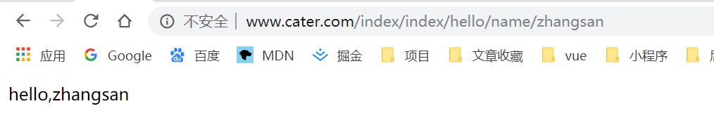

### 4.2 路由配置问题

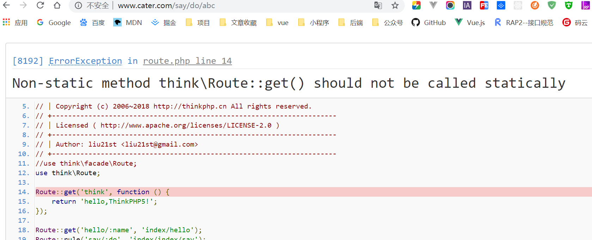

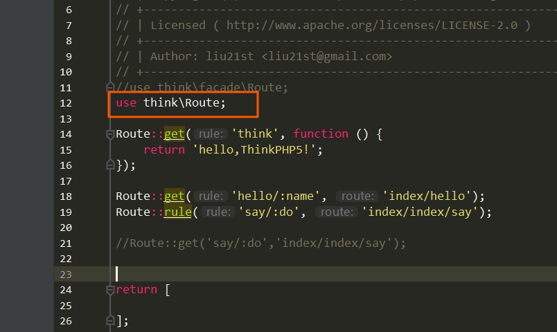

> tp5.1 中 use think\Route报错，不使用时没有提示，可以注释掉
>
> 如果想用提示，use think\facade\Route

```
facade 用处：不用实例化就可以调用类的方法

 
```

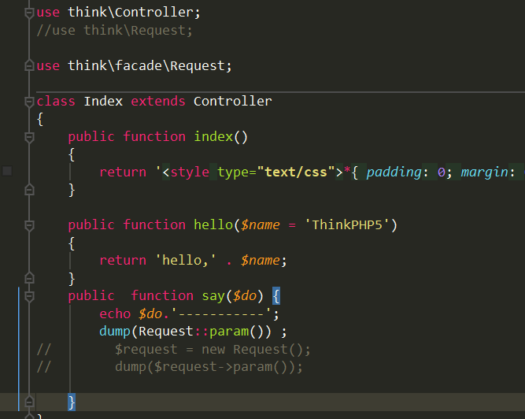


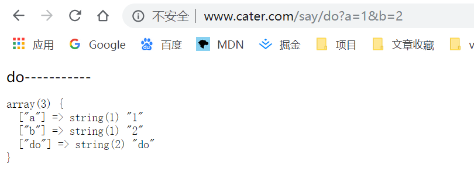


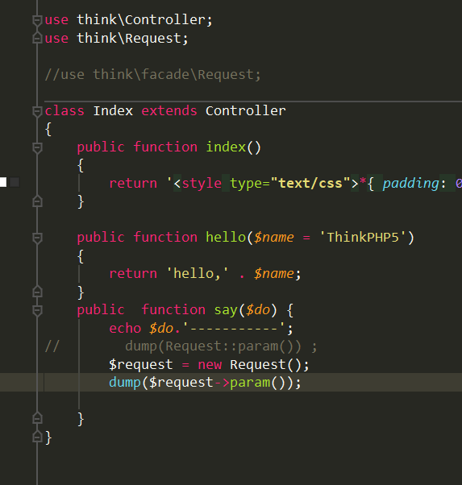


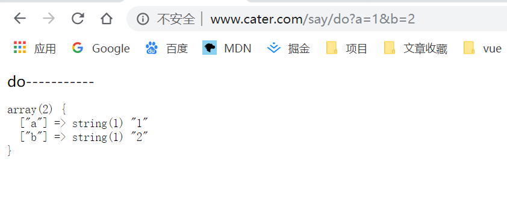


> 使用门面与不使用门面获取的参数有差异


### 4.3 路由版本

- 目录结构 application/api/controller/v1  

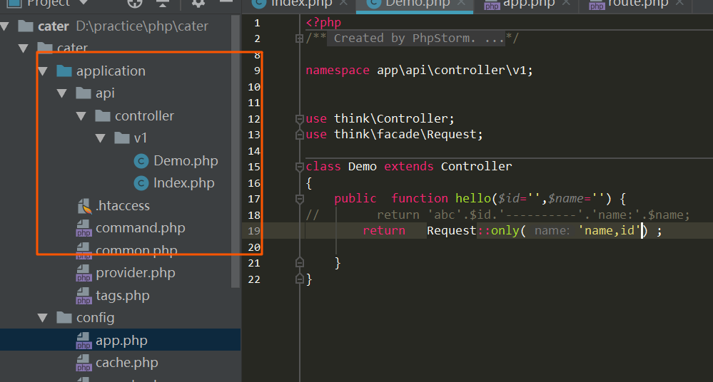

- 定义路由规则

  
  
  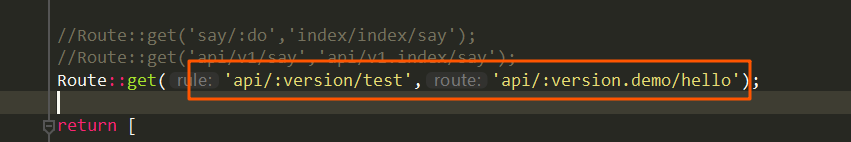

> 注意：
> 控制器名必须大写，路由中小写，否则报错控制器不存在
>
> 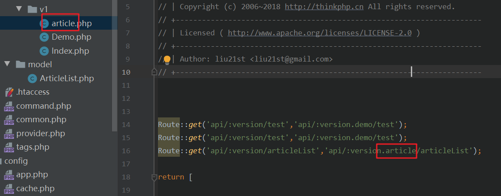

### 4.4  路由参数

获取路由参数

1. 通过param获取

```php
Request::param('name')  //获取name值
Request::param()         //获取所有传参
```

2. 通过get，post获取

```php
Request::get('name')   //获取name值
Request::get()         //获取get请求所有参数

    
//http://www.cater.com/api/v1/postAddOne  
//Route::post('api/:version/postAddOne','api/:version.demo/postAddOne');    
Request::post('name')
Request::post()         //
Request::post(false)    //  {"name": "same", "age": "19", "sex": "女"}
```

3. only、except获取请求参数中指定参数

```php
Request::only('name')  //获取name值
Request::only(['name','age'])  //只获取name及age值
Request::only('name,age')      //同上   

// 设置默认值
Request::only(['id'=>0,'name'=>'']);   

Request:except('name,id') //排除name,id参数
Request:except(['name','id'])    //排除name,id参数
```

4. 使用助手函数

```php
//判断变量是否定义
input('?get.id');   //get请求是是否有id
input('?post.name');

input('param.name'); // 获取单个参数
input('param.'); // 获取全部参数
// 下面是等效的
input('name'); 
input('');


//使用过滤方法
input('get.name','','htmlspecialchars'); // 获取get变量 并用htmlspecialchars函数过滤

//使用变量修饰符
input('get.id/d');
input('post.name/s');

```


### 4.5 模型使用

1. 模型文件名与数据库表明对应

> ​	user表匹配时会忽略前缀  如user会匹配 think_user
>
> ​	userType 会匹配 think_user_type

2. 模型中使用增删改查

   2.1 增加数据

   ```php
   //route
   Route::get('api/:version/addOne','api/:version.demo/addOne'); //一条
   Route::get('api/:version/addMany','api/:version.demo/addMany');//多条
   Route::post('api/:version/postAddOne','api/:version.demo/postAddOne');//post提交
   Route::post('api/:version/usePost','api/:version.demo/usePost');
   
   
   //model/user
   public function addOne() {
           $res = User::Create([
               'name'=>'lisa',
               'age'=>'34',
               'sex'=>'女'
           ]);
           return $res;
       }
   
   public function addMany(){
           $res = User::Create([
               ['name'=>'abc', 'age'=>'30', 'sex'=>'女'],
               ['name'=>'tiny', 'age'=>'20', 'sex'=>'男'],
               ['name'=>'mac', 'age'=>'10', 'sex'=>'女'],
           ]);
           return $res;
       }
   
   public function  postAddOne($data) {
           $res = User::Create($data);
           return $res;
       }
   
   //在model中直接使用Request类，需要引入
    public function  usePost(){
           $data=Request::post();
           $res=User::Create($data);
           return $res;
       }
   
   
   //controller
   public function addOne() {
           $user = new User();
           $res = $user->addOne();
           return $res;
       }
   
   public function  addMany() {
           $user = new user();
           $res = $user->addMany();
           return $res;
       }
   //通过请求参数
   public function  postAddOne() {
           $user= new User();
   //        $data = Request::only('name,age,sex');
           $data = Request::post();
           $res = $user->postAddOne($data);
           return $res;
       }
   
   public function  usePost() {
           $user = new User;
           return $user->usePost();
       }
   
   //如果你通过外部提交赋值给模型，并且希望指定某些字段写入，可以使用：
   $user = new User;
   // post数组中只有name和email字段会写入
   $user->allowField(['name','email'])->save($_POST);
   ```

   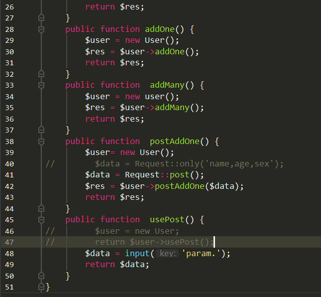

   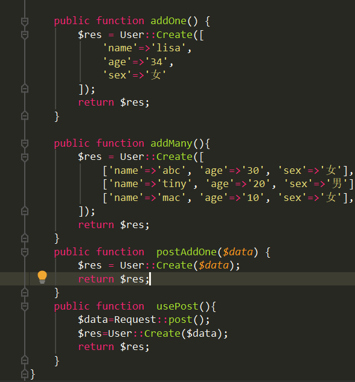

   

   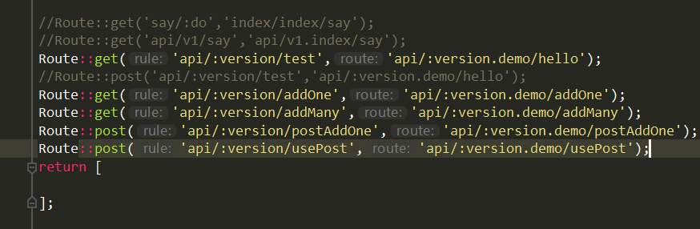

   - 返回添加的数据

     

  ### 4.6  开启自动时间戳

-  全局开启：配置database中auto_timestamp为ture

  > auto_timestamp 值：默认为int类型，可以选datetime

   配置写在model中

```php
    // 关闭自动写入update_time字段
    protected $updateTime = false;
	// 定义时间戳字段名
    protected $createTime = 'create_at';
    protected $updateTime = 'update_at';
```

