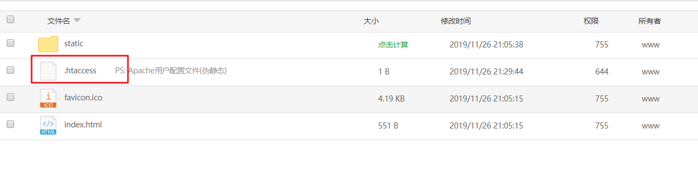

# 服务器环境搭建-tp5

> 本地环境：
>
> Apache： 2.4
>
> php：7.3.10
>
> mysql：5.7.26

 

### 1. 安装Apache

依次输入如下命令：

- ```js
  yum update -y   //更新包和存储库
  ```

- ```php
  yum install httpd -y   //安装apache
  ```

- ```php
  httpd -v    //检查是否安装成功
  
  //Server version: Apache/2.4.6 (CentOS)
  //Server built:   Aug  8 2019 11:41:18
  
  ```

配置Apache：

```php
vim /etc/httpd/conf/httpd.conf  //打开httpd.conf配置文件
```

1. 在`Include conf.modules.d/*.conf`的下一行，添加`LoadModule rewrite_module modules/mod_rewrite.so`。具体步骤如下：

   1. 移动光标到`Include conf.modules.d/*.conf`下一行的行首。
   2. 按下`i`键进入编辑模式。
   3. 输入`LoadModule rewrite_module modules/mod_rewrite.so`。
   4. 按下`Esc`键，输入`:w`并回车以保存修改。

   1. 将下列内容中的`AllowOverride None`更改为`AllowOverride All`。

      

      ```
      # AllowOverride controls what directives may be placed in .htaccess files.
      # It can be "All", "None", or any combination of the keywords:
      # Options FileInfo AuthConfig Limit
      #
      AllowOverride None
      ```

      具体步骤如下：

      1. 运行**/AllowOverride controls what**命令，找到要替换的内容。
      2. 移动光标至`AllowOverride None`。
      3. 按下`R`键进入替换模式。
      4. 输入`AllowOverride All `。

   2. 按下`Esc`键后，输入`:wq`并回车以保存并关闭配置文件。

2. 启动Apache服务。

   1. 运行以下命令启动Apache服务。

      ```
      systemctl start httpd
      ```

   2. 运行以下命令添加Apache服务开机自启动。

      ```
      systemctl enable httpd
      ```

3. 配置网站根目录

   ```php
   #
   ServerAdmin root@localhost
   
   
   ServerName "http://118.178.181.177:80"
   
   
   <Directory />
       AllowOverride all
       Require all denied
   </Directory>
   
   
   DocumentRoot "/var/www/html/cater/public"
   #  DocumentRoot "/home/cater/cater/public"
   
   #
   # Relax access to content within /var/www.
   #
   <Directory "/var/www/html/cater/public">
   # <Directory "/home/cater/cater/public">
       # AllowOverride None
       AllowOverride All
       # Allow open access:
       Require all granted
   </Directory>
   
   # Further relax access to the default document root:
   <Directory "/var/www/html/cater/public">
      
       Options Indexes FollowSymLinks
   
    
       # AllowOverride None
       AllowOverride All
   
      
       Require all granted
   </Directory>
   ```

### 2. 安装mysql

成以下操作，安装配置MySQL：

1. 安装MySQL。

   1. 运行以下命令添加MySQL YUM源。

      

      ```
      rpm -Uvh http://dev.mysql.com/get/mysql57-community-release-el7-8.noarch.rpm
      ```

   2. 运行以下命令安装MySQL。

      

      ```
      yum -y install mysql-community-server
      ```

2. 启动MySQL服务并设置开机自启动。

   1. 运行以下命令启动MySQL服务。

      

      ```
      systemctl start mysqld
      ```

   2. 运行以下命令设置MySQL服务开机自启动。

      

      ```
      systemctl enable mysqld
      ```

3. 配置MySQL。

   1. 运行以下命令查看/var/log/mysqld.log文件，获取并记录root用户的初始密码。

      

      ```
      # grep 'temporary password' /var/log/mysqld.log
      2016-12-13T14:57:47.535748Z 1 [Note] A temporary password is generated for root@localhost: p0/G28g>lsHD
      ```

      

      **说明** 下一步重置root用户密码时，会使用该初始密码。

   2. 运行下列命令配置MySQL的安全性。

      

      ```
      mysql_secure_installation
      ```

      安全性的配置包含以下五个方面：

      1. 设置root账号密码。

         

         ```
         Enter password for user root: #输入上一步中获取的root用户密码
         The 'validate_password' plugin is installed on the server.
         The subsequent steps will run with the existing configuration of the plugin.
         Using existing password for root.
         Estimated strength of the password: 100 
         Change the password for root ? ((Press y|Y for Yes, any other key for No) : Y #是否更改root用户密码，输入Y
         New password: #输入密码，长度为8至30个字符，必须同时包含大小写英文字母、数字和特殊符号。特殊符号可以是()` ~!@#$%^&*-+=|{}[]:;‘<>,.?/
         Re-enter new password: #再次输入密码
         Estimated strength of the password: 100 
         Do you wish to continue with the password provided?(Press y|Y for Yes, any other key for No) : Y
         ```

      2. 输入

         ```
         Y
         ```

         删除匿名用户账号。

         

         ```
         By default, a MySQL installation has an anonymous user, allowing anyone to log into MySQL without having to have a user account created for them. This is intended only for testing, and to make the installation go a bit smoother. You should remove them before moving into a production environment.
         Remove anonymous users? (Press y|Y for Yes, any other key for No) : Y  #是否删除匿名用户，输入Y
         Success.
         ```

      3. 输入

         ```
         Y
         ```

         禁止root账号远程登录。

         

         ```
         Disallow root login remotely? (Press y|Y for Yes, any other key for No) : Y #禁止root远程登录，输入Y
         Success.
         ```

      4. 输入

         ```
         Y
         ```

         删除test库以及对test库的访问权限。

         

         ```
         Remove test database and access to it? (Press y|Y for Yes, any other key for No) : Y #是否删除test库和对它的访问权限，输入Y
         - Dropping test database...
         Success.
         ```

      5. 输入

         ```
         Y
         ```

         重新加载授权表。

         

         ```
         Reload privilege tables now? (Press y|Y for Yes, any other key for No) : Y #是否重新加载授权表，输入Y
         Success.
         All done!
         ```

###      3. 安装PHP

1. 依次运行以下命令安装PHP YUM源。

   

   ```
   # yum install -y http://dl.iuscommunity.org/pub/ius/stable/CentOS/7/x86_64/ius-release-1.0-14.ius.centos7.noarch.rpm
   # yum -y update
   # rpm -Uvh https://mirror.webtatic.com/yum/el7/webtatic-release.rpm
   ```

2. 运行以下命令安装PHP7及所需扩展。

   ```php
   yum -y install php70w php70w-pdo php70w-mysqlnd php70w-opcache php70w-xml php70w-gd php70w-mcrypt php70w-devel php70w-intl php70w-mbstring php70w-bcmath php70w-json php70w-iconv
   
   ```

   > 安装7.2版本  需将70w替换为72w

3. 运行以下命令查看PHP版本。

   

   ```
   php -v
   ```

   返回结果如下，说明PHP安装成功

   ```
   PHP 7.0.33 (cli) (built: Dec  6 2018 22:30:44) ( NTS )
   Copyright (c) 1997-2017 The PHP Group
   Zend Engine v3.0.0, Copyright (c) 1998-2017 Zend Technologies
       with Zend OPcache v7.0.33, Copyright (c) 1999-2017, by Zend Technologies                        
   ```

1. 配置PHP。

   1. 运行以下命令打开PHP配置文件。

      

      ```
      vim /etc/php.ini
      ```

   2. 移动光标至最后一行的行尾。具体操作步骤如下：

      1. 输入`:$`并回车，光标将移动至文件最后一行。
      2. 按下`$`移动光标至行尾。

   3. 按下`i`键进入编辑模式。

   4. 在文件最后添加以下配置。

      ```
      memory_limit = 1024M #您可根据实际情况增加或减少内存限制
      date.timezone = Asia/Shanghai #设置时区为上海。
      ```

      添加后如下图所示。
      [](http://static-aliyun-doc.oss-cn-hangzhou.aliyuncs.com/assets/img/3378139651/p44781.png)

   5. 按下`Esc`键后，输入`:wq`并回车以保存并关闭文件。

   6. 重启Web服务进程。

      ```
      systemctl restart httpd
      ```

### 4. 问题记录

#### 1. Class 'PDO' not found 

> Class 'PDO' not found就是缺少pdo扩展  `yum install php72w-pdo.x86_64` 
>
> 注意对应版本

#### 2. could not find driver

> 因为PHP7没有pdo_mysql扩展 安装上即可
>
>   `yum install php72w-mysqlnd.x86_64`

#### 3. 线上环境注意更换数据库地址及名称


#### 4.  mkdir(): Permission denied in /var/www/html/cater/thinkphp/library/think/log/driver/File.php:61报错

   >  创建文件夹失败，runtime权限不够
   >
   > 解决方法：进入项目根目录，输入命令：chmod -R 777 runtime

#### 5. vue项目打包后只能通过首页一步步访问，其他页面刷新404

> 由于路由中使用history模式，需要配置apache

```php
// 1. 在项目跟目录新建.htaccess文件
// 2.复制一下内容
<IfModule mod_rewrite.c>
  RewriteEngine On
  RewriteBase /
  RewriteRule ^index\.html$ - [L]
  RewriteCond %{REQUEST_FILENAME} !-f
  RewriteCond %{REQUEST_FILENAME} !-d
  RewriteRule . /index.html [L]
</IfModule>
```



